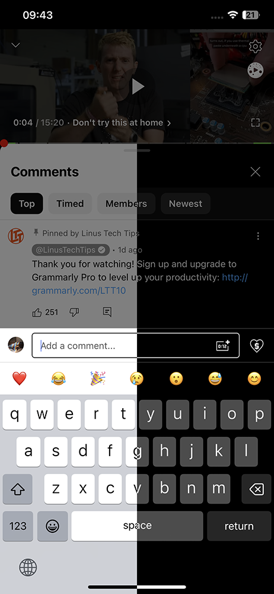
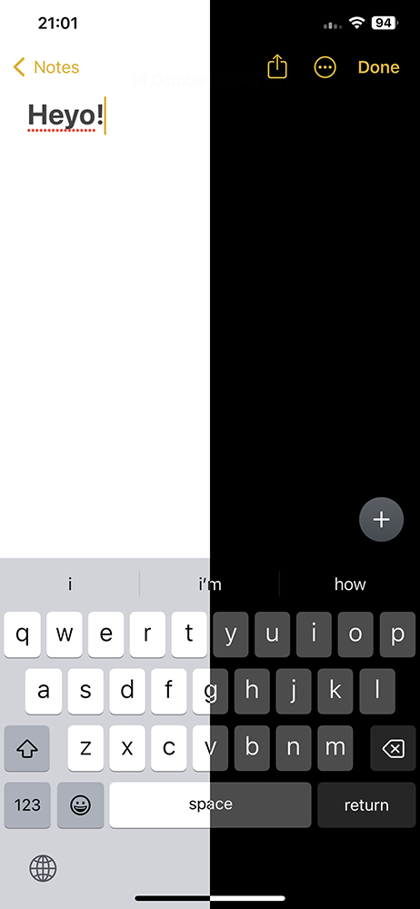
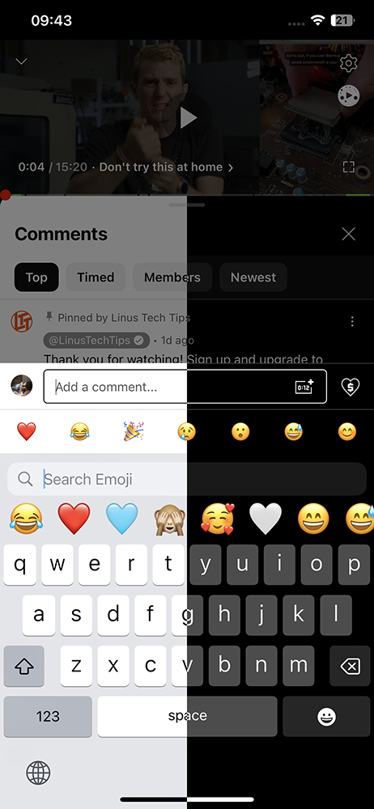
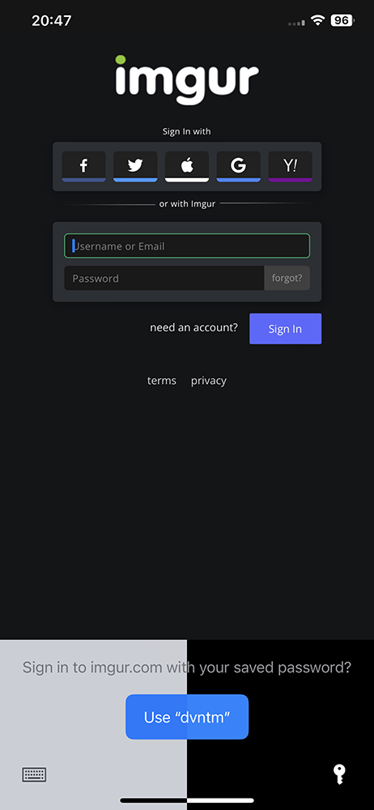
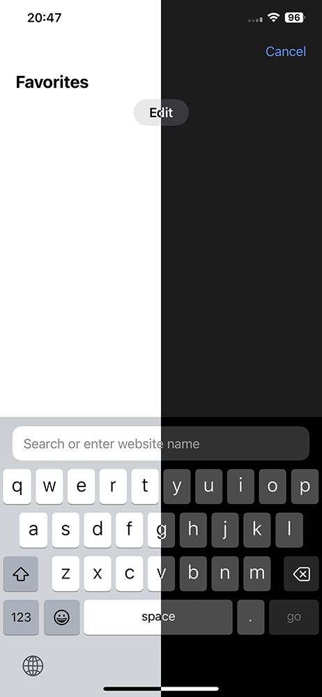
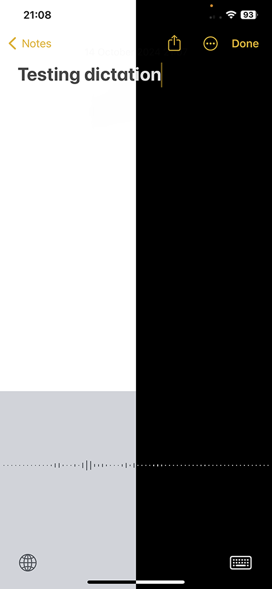

# OledKeyboard
<li>OLED Dark Mode for iOS System Keyboard: Enhance the keyboard interface with a dark theme optimized for OLED displays.</li>
 
<li>Supports Rootful, Rootless and Roothide jailbreaks</li>
<li>Tested on iOS 14.8 (jb), iOS 16.4.1 (jb) and iOS 17.4.1 (jailed, by sideloading ipa). No options to configure</li>

## Screenshots
<table>
   <tr>
      <td></td>
      <td></td>
      <td></td>
   </tr>
</table>

  
More screenshots

  <table>
    <tr>
      <td></td>
      <td></td>
      <td></td>
    </tr>
  </table>

